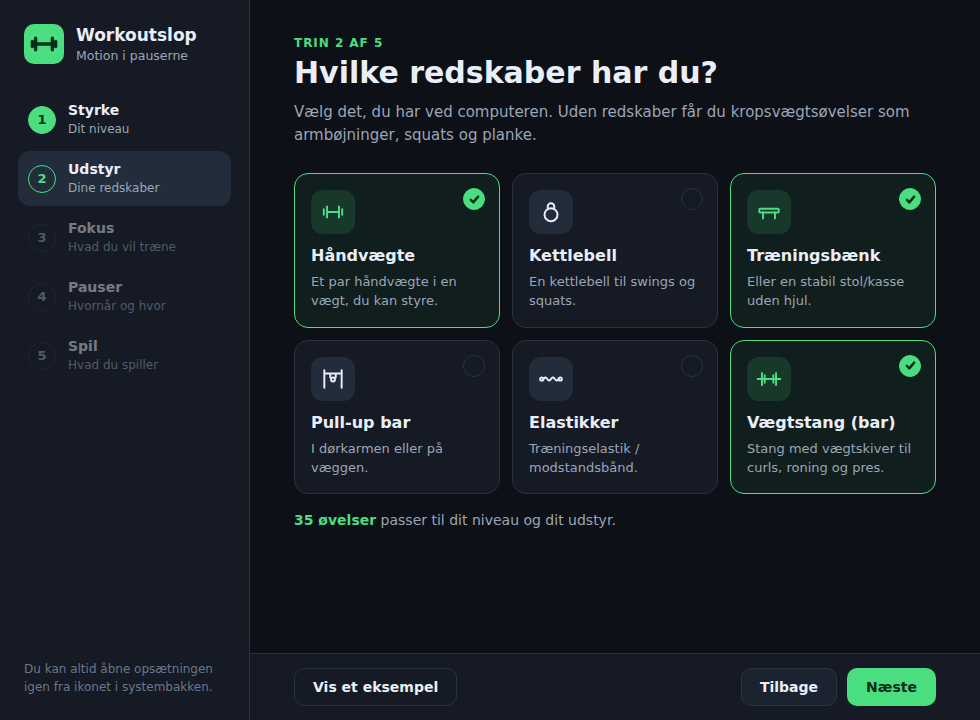

# Workoutslop – motion i pauserne mellem dine kampe

Workoutslop er et motionsoverlay til computerspil. Appen kører i baggrunden, mens du spiller. Når der er en
pause i spillet, fx mellem to kampe, foreslår den en øvelse: armbøjninger, pull-ups, curls og meget mere.
En animation viser, hvordan øvelsen laves. Antallet af gentagelser passer til dit styrkeniveau og til, hvor
lang tid der er gået siden din sidste øvelse.

<p align="center"></p>

## Sådan bruges den

1. **Start appen.** Første gang kommer en hurtig opsætning i seks trin. Den kan altid åbnes igen fra ikonet i
   systembakken (ved uret):
   - **Styrke** – Begynder, Let øvet, Øvet eller Stærk.
   - **Udstyr** – håndvægte, kettlebell, træningsbænk, pull-up bar, elastikker og/eller vægtstang. Uden
     udstyr får du kropsvægtsøvelser.
   - **Fokus** – hvad du vil træne: Bryst & skuldre, Ryg/nakke & holdning, Ben & mave, Arme – eller en
     kombination, fx Bryst & skuldre + Arme. "Arme" dækker biceps, triceps og underarme/greb. Vælger du
     intet, får du hele kroppen.
   - **Øvelser** – hvor mange sæt hver muskelgruppe skal have om dagen, og hvilke øvelser du vil have. Sættene
     fordeles over de øvelser, du har valgt.
   - **Pauser** – hvor ofte du vil træne, om inaktivitet skal tælle som pause, hvilket hjørne overlayet skal
     vises i, og om øvelsen skal læses højt.
   - **Spil** – de spil appen kender, dine egne spil og den præcise integration til CS2 og Dota 2.

   
2. **Spil som normalt.** Workoutslop opdager selv, når et spil kører.
3. **Lav øvelsen, når overlayet dukker op**, og tryk **Færdig**. Du kan også vælge **Anden** (en anden
   øvelse), **Om 10 min** (udsæt) eller **✕** (spring over).
4. Starter næste kamp, før du har trykket på noget, bliver overlayet til en lille bjælke: "Nåede du det?"

### Genvejstaster (virker også inde i spillet)

| Tast         | Funktion                        |
| ------------ | ------------------------------- |
| `Ctrl+Alt+W` | Vis en øvelse nu                |
| `Ctrl+Alt+D` | Markér øvelsen som færdig       |
| `Ctrl+Alt+S` | Spring øvelsen over             |

Fra bakkeikonet kan du også skifte fokus (**Træn: …**), søge efter opdateringer, sætte motionen på pause
(30 min, 1 time eller resten af dagen) og se, hvor mange af dagens sæt du har lavet.

> **Eksklusiv fuldskærm:** Intet program kan vises ovenpå et spil i eksklusiv fuldskærm. Workoutslop opdager
> det og **læser øvelsen højt** i stedet – tryk `Ctrl+Alt+D`, når du er færdig. Vil du se overlayet, så kør
> spillet i **kantløst vindue** (borderless).

## Sådan virker den

### 1. Hvilket spil kører?

Hvert 5. sekund henter appen listen over kørende programmer (`tasklist` på Windows, `ps` på macOS/Linux) og
sammenligner med en liste over kendte spil, fx `cs2.exe`, `VALORANT-Win64-Shipping.exe` og
`RocketLeague.exe`. Du kan selv tilføje flere spil i opsætningen.

### 2. Er der en pause?

Appen bruger det bedste signal, den har for det spil, du spiller:

| Signal                    | Spil                          | Hvordan                                                                                   |
| ------------------------- | ----------------------------- | ----------------------------------------------------------------------------------------- |
| **Game State Integration** | Counter-Strike 2, Dota 2     | Spillet sender selv sin tilstand til appen. Pause = i menuen eller kampen er slut.        |
| **Lobby/kamp-processer**  | League of Legends             | Klienten kører hele tiden, men selve kampen er et separat program. Kun klient = lobby.   |
| **Inaktivitet**           | Alle andre spil               | Ingen mus, tastatur eller controller i fx 25 sekunder, mens spillet kører = kø, loadingskærm eller lobby. |

De præcise signaler skal være stabile i 2 sekunder, før appen tror på dem, så et enkelt mærkeligt
datapunkt ikke får overlayet til at blinke.

**CS2/Dota 2-integration:** Tryk **Installér** i opsætningen. Appen finder spillet i dine Steam-biblioteker og
lægger en lille konfigurationsfil (`gamestate_integration_workoutslop.cfg`) i spillets `cfg`-mappe. Spillet
sender så sin tilstand til `http://127.0.0.1:3417`. Kun beskeder med appens hemmelige nøgle bliver
accepteret. Dota 2 kræver desuden startindstillingen `-gamestateintegration` i Steam.

### 3. Hvor mange gentagelser?

Hver øvelse har en grundmængde for hvert styrkeniveau (fx armbøjninger: 5 / 10 / 18 / 28). Den ganges med en
faktor, der afhænger af tiden siden din sidste øvelse:

| Tid siden sidste øvelse | Faktor | Armbøjninger på "Øvet" |
| ----------------------- | ------ | ---------------------- |
| Lige nu                 | 0,5×   | 9                      |
| 10 min.                 | 0,8×   | 14                     |
| 20 min.                 | 1,0×   | 18                     |
| 45 min.                 | 1,2×   | 22                     |
| 90 min. eller mere      | 1,4×   | 25                     |

Kort tid siden betyder trætte muskler og færre gentagelser. Lang tid betyder mere overskud. Er der gået
mere end 6 timer, starter du forfra med normal mængde, fordi du ikke er varmet op. Øvelser på tid (planke,
vægsid, hæng i stangen) rundes til hele 5 sekunder og har en indbygget timer.

### 4. Hvilken øvelse?

Kun øvelser, der passer til dit udstyr, dit niveau og dit fokus, kan vælges. En øvelse kan høre til flere
fokusområder – pull-ups tæller fx både som ryg og arme. Passer ingen øvelser til dit fokus med det udstyr, du
har, får du en øvelse fra hele kroppen i stedet. For variationens skyld gøres det mindre
sandsynligt at få samme øvelse som sidst, en øvelse fra den seneste time eller den samme muskelgruppe som
sidst. Øvelser med dit eget udstyr bliver valgt lidt oftere.

### 5. Dagens sæt

Hver muskelgruppe har et antal sæt om dagen (fx bryst 3, ben 4). Hver gennemført øvelse tæller som ét sæt.
Workoutslop vælger først øvelser til de muskelgrupper, der mangler flest sæt, og spreder sættene ud på
forskellige øvelser. Overlayet viser fx "sæt 2 af 3 i dag". Når alle dagens sæt er lavet, foreslår appen ikke
flere øvelser før i morgen – men `Ctrl+Alt+W` giver dig altid en ekstra.

### 6. Controller og fuldskærm (Windows)

Windows' egen måling af inaktivitet ignorerer controllere. Derfor aflæser Workoutslop selv Xbox-kompatible
controllere (XInput) fire gange i sekundet, så bevægelser på pinde, knapper og triggere tæller som aktivitet.
Små udsving fra en slidt pind (drift) tæller ikke.

Workoutslop spørger også Windows, om et spil kører i eksklusiv fuldskærm. Er det tilfældet, læses øvelsen
højt med computerens danske stemme (kan slås til/fra under **Pauser → Læs øvelsen højt**).

Begge dele kaldes direkte i Windows via biblioteket [koffi](https://koffi.dev/).

## Hvad er den bygget af?

Appen er skrevet i **JavaScript, HTML og CSS** med **[Electron](https://www.electronjs.org/)**. Electron
gør det muligt at lave et gennemsigtigt vindue, der altid ligger øverst, at registrere globale genvejstaster,
at have et ikon i systembakken og at læse, hvor længe mus og tastatur har været inaktive.

```
src/
  core/                    Logikken – ren JavaScript uden Electron, så den kan testes
    catalog.js             Styrkeniveauer, udstyr, fokusområder, muskelgrupper
    exercises.js           Alle 50 øvelser med mængder, trin og tips
    workout-engine.js      Vælger øvelse og udregner antal gentagelser
    games.js               Kendte spil og genkendelse af kørende programmer
    gsi.js                 CS2/Dota 2 Game State Integration
    pause-detector.js      Afgør om der er pause lige nu
    gamepad-activity.js    Afgør om controller-input er rigtig aktivitet
    coach.js               Bestemmer hvornår overlayet vises, gøres lille eller skjules
    settings.js, stats.js  Indstillinger og dagens statistik
  main/                    Electron-hovedprocessen
    main.js                Vinduer, bakkeikon, genvejstaster og løkken der kører hvert sekund
    preload.js             Sikker bro mellem siderne og hovedprocessen
    gsi-server.js          Lokal webserver som CS2/Dota 2 sender til
    gsi-install.js         Finder spillet i Steam og installerer cfg-filen
    updater.js             Søger efter, henter og installerer nye versioner
    process-list.js        Henter listen over kørende programmer
    windows-native.js      Controller (XInput) og fuldskærmsdetektion via Windows
    store.js               Gemmer indstillinger og historik som JSON
  renderer/                Det brugeren ser
    setup/                 Opsætningen (6 trin)
    overlay/               Overlayet med øvelsen
    shared/figure.js       Tegner og animerer tændstikmanden
    shared/animations.js   Bevægelserne til alle øvelser
    shared/speech.js       Læser øvelsen højt
test/                      Automatiske tests (node --test)
tools/gallery.html         Viser alle animationer – åbn filen i en browser
assets/                    Ikoner til appen og systembakken
.github/workflows/         Bygger Windows-programmet automatisk på GitHub
```

Indstillinger og historik gemmes i `%APPDATA%\Workoutslop` på Windows (`~/Library/Application Support/Workoutslop`
på macOS, `~/.config/Workoutslop` på Linux).

### Animationerne

Tændstikmanden er bygget som et lille skelet. Hver øvelse består af nogle få nøgleposer, og animationen
glider mellem dem. Hænder og fødder kan "låses" til et punkt (fx hænderne i gulvet under en armbøjning), og
så udregnes albue og knæ med *invers kinematik*, så arme og ben altid har samme længde.

## Kom i gang (udvikling)

Kræver [Node.js](https://nodejs.org/) 20 eller nyere.

```bash
npm install
npm start        # start appen
npm test         # kør de automatiske tests
```

Vil du prøve med en tom profil (fx for at se opsætningen igen), kan du starte sådan:

```bash
WORKOUTSLOP_DATA_DIR=.workoutslop-data npm start
```

(På Windows i PowerShell: `$env:WORKOUTSLOP_DATA_DIR=".workoutslop-data"; npm start`)

## Installér appen

Workoutslop installeres som et almindeligt Windows-program med **ét installationsprogram**:
`Workoutslop-Setup-x.y.z.exe`. Det lægger en genvej i startmenuen og på skrivebordet, og appen kan
afinstalleres under **Indstillinger → Apps** som alle andre programmer. Efter installationen starter du bare
Workoutslop fra startmenuen – eller slår **Start sammen med computeren** til i opsætningen.

> **"Windows beskyttede din pc":** Programmet er ikke signeret med et (dyrt) kodesigneringscertifikat, så
> Windows SmartScreen advarer første gang. Klik **Flere oplysninger → Kør alligevel**.

## Opdateringer

Den installerede app holder sig selv opdateret:

1. Ved opstart og derefter hver 6. time tjekker den, om der er udgivet en ny version på GitHub.
2. Findes der en, hentes den i baggrunden, og du får en besked, når den er klar.
3. Opdateringen installeres, næste gang du lukker Workoutslop – eller med det samme, hvis du vælger
   **Genstart og opdatér** i bakkemenuen eller i opsætningen.

Du kan også selv vælge **Søg efter opdateringer** i bakkemenuen eller nederst i opsætningens sidebjælke, hvor
den nuværende version også står.

### Udgiv en ny version

```bash
npm run release
```

Kommandoen hæver versionsnummeret (fx 0.1.0 → 0.1.1), laver et git-tag og pusher det. Så bygger
`.github/workflows/build.yml` installationsprogrammet på en Windows-maskine hos GitHub og lægger det op under
**Releases** sammen med filen `latest.yml`, som de installerede apps bruger til at finde opdateringen.

> **Vigtigt:** Appen henter opdateringer fra GitHub Releases uden at logge ind. Det virker kun, hvis repoet er
> **offentligt**. Er repoet privat, viser appen "Der er ikke udgivet nogen version endnu (eller GitHub-repoet er
> privat)". Repoet kan gøres offentligt under **Settings → General → Danger Zone → Change visibility**.

### Byg selv

```bash
npm install
npm run dist
```

Installationsprogrammet havner i mappen `dist/`. Ved almindelige push bygger GitHub det også – det ligger under
**Actions → kørslen → Artifacts**.

### Tilføj en øvelse

1. Tilføj øvelsen i `src/core/exercises.js` (navn, muskelgruppe, udstyr, mængder pr. niveau, trin).
2. Lav en animation i `src/renderer/shared/animations.js`, eller genbrug en eksisterende.
3. Åbn `tools/gallery.html?frames` i en browser for at se nøgleposerne, og kør `npm test`. Testene tjekker
   blandt andet, at alle øvelser har en animation, og at figuren aldrig går igennem gulvet.

### Tilføj et spil

Tilføj spillets procesnavn til `KNOWN_GAMES` i `src/core/games.js`, eller tilføj det direkte i opsætningen.

## Kendte begrænsninger

- I **eksklusiv fuldskærm** kan overlayet ikke ses – øvelsen læses højt i stedet. Oplæsningen kræver en dansk
  stemme i Windows (**Indstillinger → Tid og sprog → Tale**); ellers bruges en engelsk stemme. Tryk
  **Prøv oplæsning** under Pauser for at høre den.
- **Controllere** aflæses via XInput: Xbox-controllere og de fleste pc-controllere virker. En PlayStation-
  controller virker, hvis Steam Input eller DS4Windows er slået til.
- Overlayet vises på hovedskærmen.
- Valorant, Fortnite og de fleste andre spil har ingen officiel måde at fortælle, hvornår en kamp slutter.
  Derfor bruges inaktivitet for dem.
