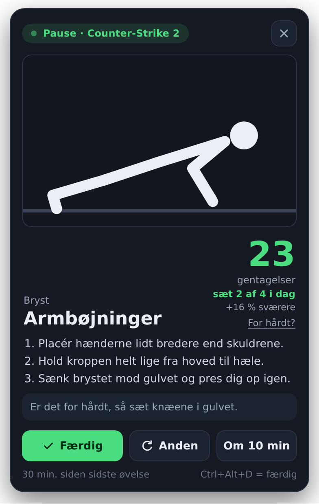
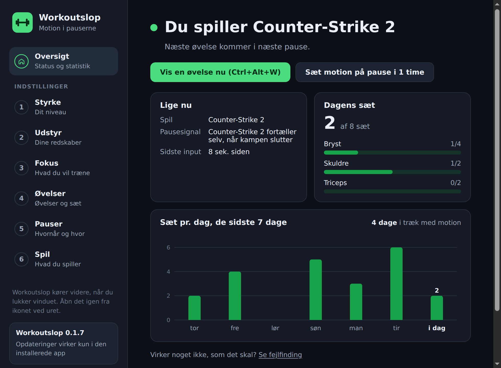

# Workoutslop – motion i pauserne mellem dine kampe

Workoutslop er et motionsoverlay til computerspil. Appen kører i baggrunden, mens du spiller. Når der er en
pause i spillet, fx mellem to kampe, foreslår den en øvelse: armbøjninger, pull-ups, curls og meget mere.
En animation viser, hvordan øvelsen laves. Antallet af gentagelser passer til dit styrkeniveau og til, hvor
lang tid der er gået siden din sidste øvelse.

<p align="center"></p>

## Hent Workoutslop

**[⬇ Hent Workoutslop til Windows](https://github.com/WhatsAFreezer/Workoutslop/releases/latest/download/Workoutslop-Setup.exe)**

1. Dobbeltklik på `Workoutslop-Setup.exe`.
2. Workoutslop installeres og starter af sig selv – der er ingen trin at klikke sig igennem.
3. Svar på den korte opsætning, og start et spil.

Linket giver altid den nyeste version, og appen opdaterer sig selv bagefter.

## Sådan bruges den

1. **Start appen.** Første gang kommer en hurtig opsætning i seks trin. Den kan altid åbnes igen fra ikonet i
   systembakken (ved uret):
   - **Styrke** – Begynder, Let øvet, Øvet eller Stærk.
   - **Udstyr** – håndvægte, kettlebell, træningsbænk, pull-up bar, elastikker og/eller vægtstang. Uden
     udstyr får du kropsvægtsøvelser.
   - **Fokus** – hvad du vil træne: Bryst & skuldre, Ryg/nakke & holdning, Ben & mave eller Arme – gerne
     flere på én gang. Med **Lav din egen dag** kombinerer du selv muskelgrupperne, fx "Push" med bryst,
     skuldre og triceps. Vælger du intet, får du hele kroppen.
   - **Øvelser** – sæt pr. dag for hver muskelgruppe, og hvilke øvelser du vil have. Grupperne i dit fokus er
     fremhævet øverst. Hold musen over en øvelse for at se den som animation med sværhedsgrad.
   - **Pauser** – hvor ofte du vil træne, om inaktivitet skal tælle som pause, hvilket hjørne overlayet skal
     vises i, og om øvelsen skal læses højt.
   - **Spil** – de spil appen kender, dine egne spil og den præcise integration til CS2 og Dota 2.

   

   Når opsætningen er gemt, viser vinduet **Oversigten**: om du spiller eller holder pause, hvad Workoutslop
   registrerer lige nu (spil, vindue, input, controller), dagens sæt pr. muskelgruppe og en graf over de sidste
   7 dage. Det er også den side, du ser, når du åbner Workoutslop fra startmenuen. Vinduet kan gøres til fuld
   skærm med **F11** eller knappen **Fuld skærm** nederst i sidebjælken (Esc går ud igen).
2. **Spil som normalt.** Workoutslop opdager selv, når et spil kører, og viser øvelsen på den skærm, spillet
   kører på.
3. **Lav øvelsen, når overlayet dukker op**, og tryk **Færdig**. Du kan også vælge **Anden** (en anden
   øvelse), **Om 10 min** (udsæt), **For hårdt?** (færre gentagelser) eller **✕** (spring over).
4. Starter næste kamp, før du har trykket på noget, bliver overlayet til en lille bjælke: "Nåede du det?"

### Genvejstaster (virker også inde i spillet)

| Tast         | Funktion                        |
| ------------ | ------------------------------- |
| `Ctrl+Alt+W` | Vis en øvelse nu                |
| `Ctrl+Alt+D` | Markér øvelsen som færdig       |
| `Ctrl+Alt+S` | Spring øvelsen over             |

Fra bakkeikonet kan du også skifte fokus (**Træn: …**), søge efter opdateringer, sætte motionen på pause
(30 min, 1 time eller resten af dagen) og se, hvor mange af dagens sæt du har lavet.

> **Eksklusiv fuldskærm:** Intet program kan vises ovenpå et spil i eksklusiv fuldskærm. Workoutslop opdager
> det og **læser øvelsen højt** i stedet – tryk `Ctrl+Alt+D`, når du er færdig. Vil du se overlayet, så kør
> spillet i **kantløst vindue** (borderless).

## Sådan virker den

### 1. Hvilket spil kører?

Hvert 5. sekund henter appen listen over kørende programmer (`tasklist` på Windows, `ps` på macOS/Linux) og
sammenligner med en liste over kendte spil, fx `cs2.exe`, `VALORANT-Win64-Shipping.exe` og
`RocketLeague.exe`.

På Windows ser appen desuden, hvilket program der er i forgrunden, og tilføjer selv nye spil:

- **Spilbiblioteker:** Ligger programmet i et spilbibliotek (Steam, Epic, Riot, Xbox, GOG, Ubisoft, EA eller
  Rockstar), er det et spil.
- **Eksklusiv fuldskærm:** Det bruger næsten kun spil, så et program i eksklusiv fuldskærm er et spil efter 3
  sekunder.
- **Fuld skærm + aktivitet:** Fylder et program skærmen i 20 sekunder, mens du bruger mus, tastatur eller
  controller det meste af tiden, er det et spil. Fylder det skærmen, uden at du rører noget (fx en film), bliver
  det kun foreslået under **Spil** i opsætningen.

Browsere, videoafspillere, terminaler, fjernskrivebord, kodeprogrammer og spilbutikker tæller aldrig. Du kan
også selv tilføje spil. Værktøjer fra Steam som Wallpaper Engine, Lossless Scaling og SteamVR tælles ikke som spil, og
finder appen et program, der ikke er et spil, kan du fjerne det med **Ikke et spil** på oversigten.

**Når du lukker spillet:** Mange spil lukker vinduet, før programmet er helt lukket – og nogle bliver liggende
i baggrunden. På Windows tæller et spil derfor kun som åbent, så længe det har et synligt vindue. Et spil
regnes som lukket, når det mangler to scanninger i træk (5–10 sekunder), og vises der en øvelse fra en pause i
spillet, forsvinder den.

### 2. Er der en pause?

Appen bruger det bedste signal, den har for det spil, du spiller:

| Signal                    | Spil                          | Hvordan                                                                                   |
| ------------------------- | ----------------------------- | ----------------------------------------------------------------------------------------- |
| **Game State Integration** | Counter-Strike 2, Dota 2     | Spillet sender selv sin tilstand til appen. Pause = i menuen eller kampen er slut.        |
| **Lobby/kamp-processer**  | League of Legends             | Klienten kører hele tiden, men selve kampen er et separat program. Kun klient = lobby.   |
| **Spillet i baggrunden**  | Alle spil (Windows)           | Har du alt-tabbet ud af spillet i mere end 15 sekunder (fx mens du venter i kø), er det en pause. |
| **Inaktivitet**           | Alle andre spil               | Ingen mus, tastatur eller controller i fx 25 sekunder, mens spillet kører = kø, loadingskærm eller lobby. |

De præcise signaler skal være stabile i 2 sekunder, før appen tror på dem, så et enkelt mærkeligt
datapunkt ikke får overlayet til at blinke.

**CS2/Dota 2-integration:** Tryk **Installér** i opsætningen. Appen finder spillet i dine Steam-biblioteker og
lægger en lille konfigurationsfil (`gamestate_integration_workoutslop.cfg`) i spillets `cfg`-mappe. Spillet
sender så sin tilstand til `http://127.0.0.1:3417`. Kun beskeder med appens hemmelige nøgle bliver
accepteret. Dota 2 kræver desuden startindstillingen `-gamestateintegration` i Steam.

### 3. Hvor mange gentagelser?

Hver øvelse har en grundmængde for hvert styrkeniveau (fx armbøjninger: 5 / 10 / 18 / 28). Den ganges med en
faktor, der afhænger af tiden siden din sidste øvelse:

| Tid siden sidste øvelse | Faktor | Armbøjninger på "Øvet" |
| ----------------------- | ------ | ---------------------- |
| Lige nu                 | 0,5×   | 9                      |
| 10 min.                 | 0,8×   | 14                     |
| 20 min.                 | 1,0×   | 18                     |
| 45 min.                 | 1,2×   | 22                     |
| 90 min. eller mere      | 1,4×   | 25                     |

Kort tid siden betyder trætte muskler og færre gentagelser. Lang tid betyder mere overskud. Er der gået
mere end 6 timer, starter du forfra med normal mængde, fordi du ikke er varmet op. Øvelser på tid (planke,
vægsid, hæng i stangen) rundes til hele 5 sekunder og har en indbygget timer.

**Mængden følger dig:** Hver 3. gang du gennemfører en øvelse, bliver den 5 % sværere (højst +50 %). Er den
for hård, så tryk **For hårdt?** under tallet – så sættes mængden ned med det samme, og den starter 20 % lavere
næste gang. Skifter du styrkeniveau, starter tilpasningen forfra.

### 4. Hvilken øvelse?

Kun øvelser, der passer til dit udstyr, dit niveau og dit fokus, kan vælges. Hver øvelse hører til én
muskelgruppe og dermed ét fokusområde – pull-ups er fx ryg, og bird dog er mave & core – så du får aldrig øvelser
uden for det fokus, du har valgt. For variationens skyld gøres det mindre
sandsynligt at få samme øvelse som sidst, en øvelse fra den seneste time eller den samme muskelgruppe som
sidst. Øvelser med dit eget udstyr bliver valgt lidt oftere.

Hver øvelse har en sværhedsgrad (let, middel eller svær), som du kan se ved at holde musen over den i
opsætningen. Er du begynder, får du mest lette øvelser – er du stærk, mest de svære.

### 5. Dagens sæt

Hver muskelgruppe har et antal sæt om dagen (fx bryst 3, ben 4). Hver gennemført øvelse tæller som ét sæt.
Workoutslop vælger først øvelser til de muskelgrupper, der mangler flest sæt, og spreder sættene ud på
forskellige øvelser. Overlayet viser fx "sæt 2 af 3 i dag". Når alle dagens sæt er lavet, foreslår appen ikke
flere øvelser før i morgen – men `Ctrl+Alt+W` giver dig altid en ekstra.

### 6. Controller og fuldskærm (Windows)

Windows' egen måling af inaktivitet ignorerer controllere. Derfor aflæser Workoutslop selv Xbox-kompatible
controllere (XInput) fire gange i sekundet, så bevægelser på pinde, knapper og triggere tæller som aktivitet.
Små udsving fra en slidt pind (drift) tæller ikke.

Workoutslop spørger også Windows, om et spil kører i eksklusiv fuldskærm. Er det tilfældet, læses øvelsen
højt med computerens danske stemme (kan slås til/fra under **Pauser → Læs øvelsen højt**).

Begge dele kaldes direkte i Windows via biblioteket [koffi](https://koffi.dev/).

## Hvad er den bygget af?

Appen er skrevet i **JavaScript, HTML og CSS** med **[Electron](https://www.electronjs.org/)**. Electron
gør det muligt at lave et gennemsigtigt vindue, der altid ligger øverst, at registrere globale genvejstaster,
at have et ikon i systembakken og at læse, hvor længe mus og tastatur har været inaktive.

```
src/
  core/                    Logikken – ren JavaScript uden Electron, så den kan testes
    catalog.js             Styrkeniveauer, udstyr, fokusområder, muskelgrupper
    exercises.js           Alle 71 øvelser med mængder, sværhedsgrad, trin og tips
    workout-engine.js      Vælger øvelse og udregner antal gentagelser
    games.js               Kendte spil og genkendelse af kørende programmer
    gsi.js                 CS2/Dota 2 Game State Integration
    pause-detector.js      Afgør om der er pause lige nu
    gamepad-activity.js    Afgør om controller-input er rigtig aktivitet
    game-detection.js      Finder nye spil i spilbiblioteker og fuldskærmsprogrammer
    coach.js               Bestemmer hvornår overlayet vises, gøres lille eller skjules
    settings.js, stats.js  Indstillinger (også dine egne dage) og statistik
    event-log.js           Hændelsesloggen til fejlfinding
  main/                    Electron-hovedprocessen
    main.js                Vinduer, bakkeikon, genvejstaster og løkken der kører hvert sekund
    preload.js             Sikker bro mellem siderne og hovedprocessen
    gsi-server.js          Lokal webserver som CS2/Dota 2 sender til
    gsi-install.js         Finder spillet i Steam og installerer cfg-filen
    updater.js             Søger efter, henter og installerer nye versioner
    process-list.js        Henter listen over kørende programmer
    windows-native.js      Controller, fuldskærm, forgrundsvindue og "altid øverst" via Windows
    store.js               Gemmer indstillinger og historik som JSON
  renderer/                Det brugeren ser
    setup/                 Opsætningen (6 trin)
    overlay/               Overlayet med øvelsen
    shared/figure.js       Tegner og animerer tændstikmanden
    shared/animations.js   Bevægelserne til alle øvelser
    shared/speech.js       Læser øvelsen højt
test/                      Automatiske tests (node --test)
tools/gallery.html         Viser alle animationer – åbn filen i en browser
assets/                    Ikoner til appen og systembakken
.github/workflows/         Bygger Windows-programmet og udgiver nye versioner på GitHub
```

Indstillinger og historik gemmes i `%APPDATA%\Workoutslop` på Windows (`~/Library/Application Support/Workoutslop`
på macOS, `~/.config/Workoutslop` på Linux).

### Animationerne

Tændstikmanden er bygget som et lille skelet. Hver øvelse består af nogle få nøgleposer, og animationen
glider mellem dem. Hænder og fødder kan "låses" til et punkt (fx hænderne i gulvet under en armbøjning), og
så udregnes albue og knæ med *invers kinematik*, så arme og ben altid har samme længde.

## Kom i gang (udvikling)

Kræver [Node.js](https://nodejs.org/) 20 eller nyere.

```bash
npm install
npm start        # start appen
npm test         # kør de automatiske tests
```

Vil du prøve med en tom profil (fx for at se opsætningen igen), kan du starte sådan:

```bash
WORKOUTSLOP_DATA_DIR=.workoutslop-data npm start
```

(På Windows i PowerShell: `$env:WORKOUTSLOP_DATA_DIR=".workoutslop-data"; npm start`)

## Installér appen

Installationen er én fil: [`Workoutslop-Setup.exe`](https://github.com/WhatsAFreezer/Workoutslop/releases/latest/download/Workoutslop-Setup.exe). Dobbeltklik på den, så sker resten automatisk:

- Workoutslop installeres for din bruger (det kræver ikke administrator).
- Der kommer en genvej i startmenuen og på skrivebordet.
- Appen starter og viser opsætningen.

Når opsætningen er gemt, kører Workoutslop i baggrunden med et ikon ved uret (klik på **^**, hvis det er
skjult). Åbner du Workoutslop fra startmenuen igen, kommer vinduet frem. Slår du **Start sammen med
computeren** til, starter appen stille i baggrunden, når computeren tænder.

Appen afinstalleres under **Indstillinger → Apps** som alle andre programmer. Dine indstillinger og din
træningshistorik bliver liggende, så de er der, hvis du installerer igen.

> **"Windows beskyttede din pc":** Programmet er ikke signeret med et (dyrt) kodesigneringscertifikat, så
> Windows SmartScreen advarer første gang. Klik **Flere oplysninger → Kør alligevel**.

## Opdateringer

Den installerede app holder sig selv opdateret:

1. Ved opstart, efter dvale og derefter hver 6. time tjekker den, om der er udgivet en ny version på GitHub.
2. Findes der en, hentes den i baggrunden.
3. Når der ikke har kørt et spil i et par minutter, installeres den nye version, og appen genstarter stille i
   baggrunden. Du får en besked, når det er sket. Vil du ikke vente, så vælg **Genstart og opdatér** i
   bakkemenuen eller nederst i sidebjælken.

Den nuværende version står nederst i sidebjælken, hvor du også kan vælge **Søg efter opdateringer**.

### Udgiv en ny version

1. Gå til fanen **Actions** på GitHub og vælg **Udgiv ny version** i listen til venstre.
2. Klik **Run workflow**, vælg hvor stor ændringen er (normalt *patch*), og klik **Run workflow** igen.

GitHub hæver versionsnummeret (fx 0.1.0 → 0.1.1), tester og bygger appen på en Windows-maskine og lægger
`Workoutslop-Setup.exe` op under **Releases** sammen med filen `latest.yml`. Det er den fil, de installerede
apps bruger til at finde opdateringen – så udgiv altid nye versioner på den måde og ikke ved at oprette en
release i hånden.

> Appen henter opdateringer fra GitHub uden at logge ind, så repoet skal være **offentligt**.

### Byg selv

```bash
npm install
npm run dist
```

Installationsprogrammet (`Workoutslop-Setup.exe`) havner i mappen `dist/`. Ved almindelige push bygger GitHub det også – det ligger under
**Actions → kørslen → Artifacts**.

### Tilføj en øvelse

1. Tilføj øvelsen i `src/core/exercises.js` (navn, muskelgruppe, udstyr, mængder pr. niveau, trin).
2. Lav en animation i `src/renderer/shared/animations.js`, eller genbrug en eksisterende.
3. Åbn `tools/gallery.html?frames` i en browser for at se nøgleposerne, og kør `npm test`. Testene tjekker
   blandt andet, at alle øvelser har en animation, og at figuren aldrig går igennem gulvet.

### Tilføj et spil

Tilføj spillets procesnavn til `KNOWN_GAMES` i `src/core/games.js`, eller tilføj det direkte i opsætningen.

## Virker noget ikke?

Åbn **Fejlfinding** nederst i venstre side af vinduet (eller fra oversigten). Den viser, hvad Workoutslop
registrerer lige nu – spil, vindue, fuldskærm, pausesignaler, controller – og en log over, hvad der er sket,
siden appen startede. Tryk **Kopiér rapport**, og send den sammen med en beskrivelse af problemet. Rapporten
indeholder navnene på de programmer, du har haft åbne, men ingen filstier eller vinduestitler.

## Kendte begrænsninger

- I **eksklusiv fuldskærm** kan intet program vises ovenpå et spil. Workoutslop opdager det, viser en
  advarsel i oversigten og læser øvelsen højt. Vil du se overlayet, så vælg *kantløst vindue* / *fuldskærm i
  vindue* i spillets grafikindstillinger. I kantløs fuldskærm lægger appen overlayet øverst igen hvert halve
  sekund, så spil, der selv lægger sig øverst, ikke dækker det.
- Oplæsningen kræver en dansk stemme i Windows (**Indstillinger → Tid og sprog → Tale**); ellers bruges en
  engelsk stemme. Tryk **Prøv oplæsning** under Pauser for at høre den.
- **Controllere** aflæses via XInput: Xbox-controllere og de fleste pc-controllere virker. En PlayStation-
  controller virker, hvis Steam Input eller DS4Windows er slået til.
- Valorant, Fortnite og de fleste andre spil har ingen officiel måde at fortælle, hvornår en kamp slutter.
  Derfor bruges alt-tab og inaktivitet for dem.
